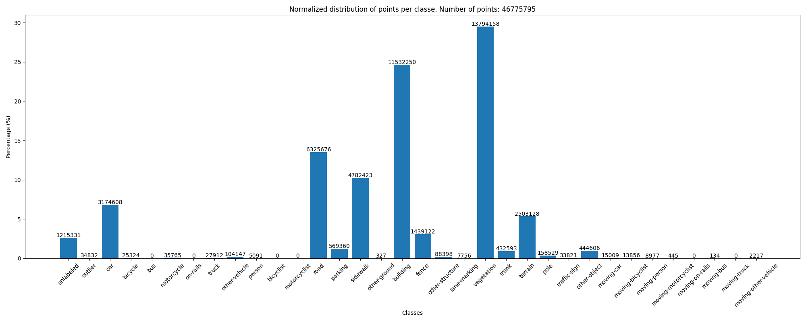
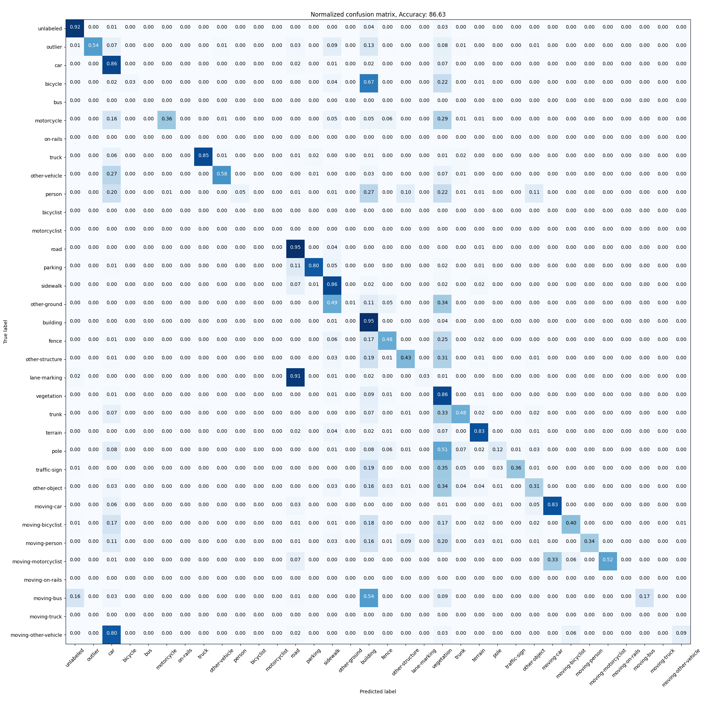
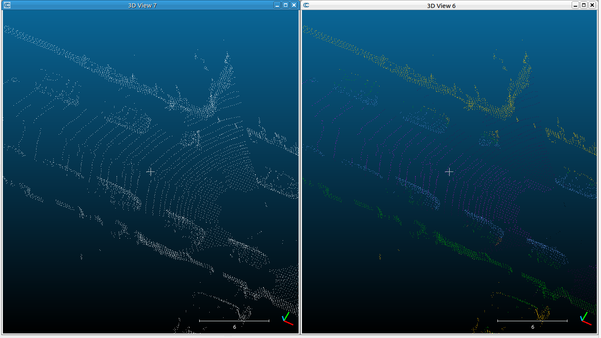

# PointNetDemo

See the [official](https://github.com/KASCedric/PointNet/blob/main/README.md#Usage) repository for usage.

This repository contains:

- `sample-model.pth`: A model based on [PointNet](https://arxiv.org/abs/1612.00593) and pre-trained on [semantic-kitti](http://www.semantic-kitti.org/) dataset 

- `raw-data.bin`: A sample data, from the [kitti odometry velodyne](http://www.cvlibs.net/datasets/kitti/eval_odometry.php) dataset (`sequence=18, pointcloud=000500.bin`).

- `ds-data.ply`: The same sample data downsampled with PCL using a voxelgrid with a `leaf_size=0.1` (10 cm)

Note: The model was trained using downsampled data of the same leaf size as `ds-data.ply`. 
The downsampling has been done in order to be able to load in memory the data for training.

### Model Evaluation:
The sequence `00` of the semantic-kitti dataset was used to train and evaluate the model.
`train_split, test_split = (0.8, 0.2)`

The training data consisted of 3633 point clouds of about 50,000 points each.
The model was trained for 20 epochs (~ 17h). 
Because of the memory limitation, the batch size was set to 1, so there was no batch normalization. 
The learning rate was set to 0.001.

The accuracy of the model is: 86.63% 

Test set classes distribution:

Confusion matrix:

### Downsampled data
Screenshot of `ds-data.ply` before and after the prediction using `sample-model.pth`:

